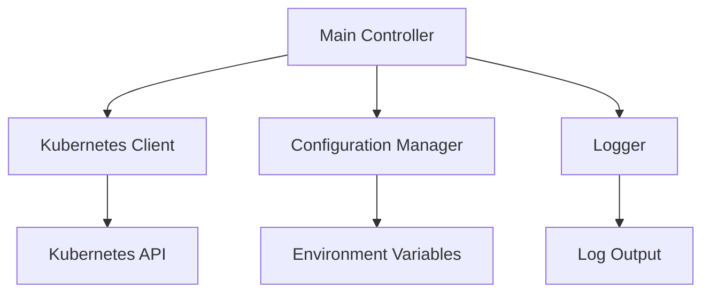

# System Patterns: k8s-ns-purger

## Architecture Overview

### Core Components
1. **Main Controller**
   - Entry point and lifecycle manager
   - Handles signal-based shutdown
   - Manages main purge loop
   - Coordinates component initialization

2. **Kubernetes Client**
   - Uses in-cluster configuration
   - Interfaces with Kubernetes API
   - Manages namespace operations
   - Handles API errors

3. **Configuration Manager**
   - Loads environment variables
   - Validates configuration
   - Provides default values
   - Supports runtime configuration

4. **Logger**
   - Structured logging
   - Operation tracking
   - Error reporting
   - Debug support

## Design Patterns

### 1. Controller Pattern
- Main loop pattern for continuous operation
- Periodic execution of purge operations
- Graceful shutdown handling
- Error recovery and retry logic

### 2. Configuration Pattern
- Environment-based configuration
- Hierarchical settings (defaults → env vars → helm values)
- Validation on startup
- Runtime configuration support

### 3. Client-Side Pattern
- Kubernetes client initialization
- API interaction handling
- Error management
- Resource cleanup

### 4. Observer Pattern
- Namespace monitoring
- Creation timestamp tracking
- Label selector filtering
- Age-based evaluation

## Technical Decisions

### 1. Language Choice: Go
- Native Kubernetes client support
- Strong concurrency support
- Efficient resource usage
- Cross-platform compatibility

### 2. Kubernetes Integration
- In-cluster configuration
- Direct API interaction
- Label-based selection
- Namespace-level operations

### 3. Resource Management
- Lightweight process
- Minimal memory footprint
- Efficient CPU usage
- Controlled intervals

### 4. Error Handling
- Graceful error recovery
- Detailed error logging
- Operation retries
- Context cancellation

## Component Relationships



## Code Organization

### Core Packages
1. **main**
   - Application entry point
   - Component initialization
   - Signal handling
   - Main loop

2. **pkg/config**
   - Configuration structs
   - Environment loading
   - Validation logic
   - Default values

3. **pkg/logging**
   - Logger setup
   - Log formatting
   - Level management
   - Output control

4. **pkg/version**
   - Version information
   - Build details
   - Runtime identification

## Implementation Patterns

### 1. Initialization
```go
// Sequential initialization pattern
logger = logging.SetupLogging()
config.LoadConfiguration()
kubeConfig = rest.InClusterConfig()
clientset = kubernetes.NewForConfig(kubeConfig)
```

### 2. Main Loop
```go
// Continuous operation pattern
for {
    deleteNamespaces()
    time.Sleep(config.CFG.Interval)
}
```

### 3. Resource Management
```go
// Resource cleanup pattern
func deleteNamespaces() {
    // List namespaces with label selector
    // Calculate deletion threshold
    // Delete qualifying namespaces
}
```

### 4. Error Handling
```go
// Error management pattern
if err != nil {
    logger.Errorf("Error: %v", err)
    return
}
```

## Security Patterns

### 1. RBAC Integration
- ClusterRole definition
- Minimal permissions
- Namespace-scoped operations
- Role binding

### 2. Container Security
- Non-root execution
- Read-only filesystem
- No privilege escalation
- Resource limits

## Testing Patterns

### 1. Unit Testing
- Function-level testing
- Error case validation
- Configuration testing
- Mock interfaces

### 2. Integration Testing
- Kubernetes API interaction
- Configuration loading
- End-to-end workflows
- Error scenarios
